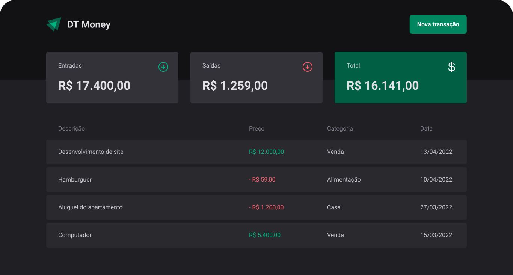

<!-- Logotipo -->
<div align="center">
  
</div>

<!-- Logo -->
<h1 align="center"> DT Money - Remastered </h1>
<!-- Sobre o Projeto -->

## 🧐 Sobre o Projeto

Este projeto é um controle financeiro, que foi desenvolvido durante o treinamento do Ignite, na trilha de ReactJS. Foi abordado vários conceitos como: contextos, acessibilidade, hooks e performance.

## 🚀 Tecnologias e Bibliotecas

- [Axios](https://axios-http.com/)
- [ESLint](https://eslint.org/)
- [Json Server](https://github.com/typicode/json-server)
- [Radix UI](https://www.radix-ui.com/)
- [React](https://pt-br.reactjs.org/)
- [React Developer Tools](https://chrome.google.com/webstore/detail/react-developer-tools/fmkadmapgofadopljbjfkapdkoienihi)
- [Rocketseat eslint-config](https://github.com/Rocketseat/eslint-config-rocketseat)
- [Styled Components](https://styled-components.com/)
- [Typescript](https://www.typescriptlang.org/)
- [use-context-selector](https://www.npmjs.com/package/use-context-selector)
- [ViteJS](https://vitejs.dev/)
- [Visual Studio Code](https://code.visualstudio.com/)
- [Zod](https://zod.dev/)

## 💻 Rodando o Projeto

```bash
# Realize o Clone deste repositório
https://github.com/lucasbarque/DTMoneyRemastered.git
# ou use a opção de download.
# Acesse a pasta do projeto
$ cd DTMoneyRemastered
# Instale as dependências
$ yarn install
ou
$ npm install
# Executando o Projeto
$ yarn dev
ou
$ npm run dev
# Acesse http://localhost:3000 no seu navagador
```
